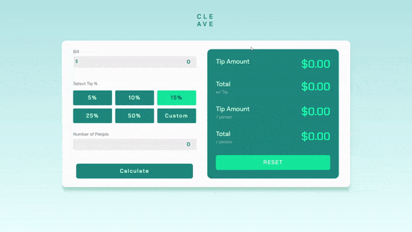

# Cleave
Cleave is a sleek tip calculator. Set the amount of the bill, the percentage you want to tip, and the number of people, and Cleave will split your bill for you. It will determine how much you should tip, and how much each person should tip.

**Link to project:** https://cleave.netlify.app/

## How It's Made:

**Tech used:** HTML, CSS, JavaScript

## Optimizations

Optimization needed: Code needs to be refactored.

## Lessons Learned:

In this project, I learned a lot about DOM manipulation and overall JS skills. It was one of the first JS projects I worked on, so my JS skills improved as a result of this project.
